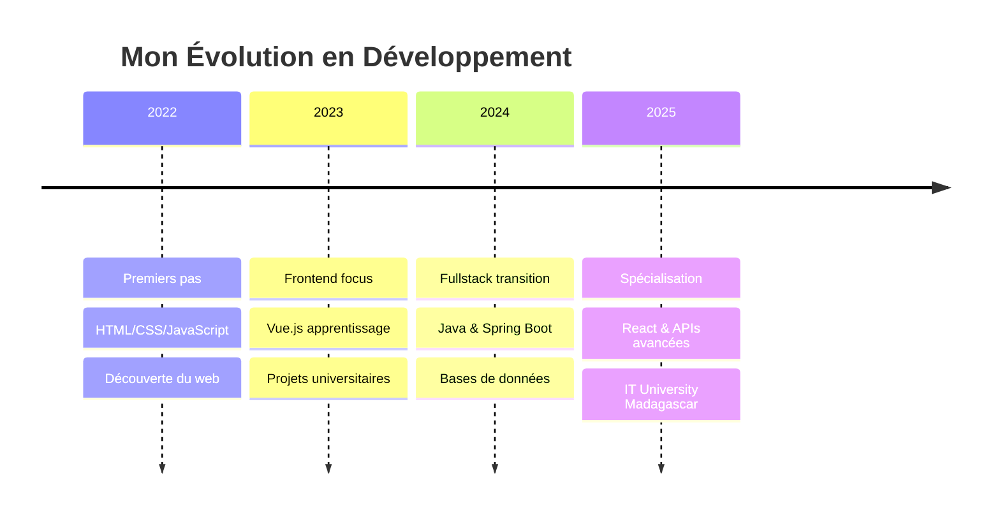

<!-- Header avec animation de vague -->
<div align="center">
  
</div>

<!-- Badges professionnels -->
<div align="center">

</div>

<br>

<div align="center">
  <a href="https://github.com/antsamadagascar">
    
  </a>
  
  
</div>

---

##  Qui suis-je ?

<table>
<tr>
<td>

**💫 Développeur Fullstack Junior passionné**

Étudiant en génie logiciel à IT University Madagascar, je me spécialise dans le développement d'applications web modernes. Passionné par l'apprentissage continu, j'aime relever de nouveaux défis techniques et créer des solutions digitales fonctionnelles.

**🎯 Mon objectif :** Maîtriser les technologies web modernes et contribuer à des projets innovants en équipe tout en développant mes compétences techniques.

</td>
<td>

```json
{
  "nom": "Ny Antsa RATOVONANDRASANA",
  "âge": "En formation continue",
  "localisation": "Antananarivo, Madagascar",
  "rôle": "Développeur Fullstack Junior",
  "passion": "Apprentissage & Développement",
  "objectif": "Expertise technique",
  "motto": "Learn, code, grow, repeat"
}
```

</td>
</tr>
</table>

---

## 🚀 Arsenal Technologique

<div align="center">

### Frontend Universe
<p>
  
  
  
  
  
</p>

### Backend Powerhouse
<p>
  
  
  
  
  
</p>

### Database & Storage
<p>
  
  
  
</p>

### Cloud & DevOps
<p>
  
  
  
</p>

</div>

---

## 📊 Performance GitHub

<div align="center">
  
  
</div>

<div align="center">
  
</div>

---

## 🎓 Formation & Compétences

<div align="center">

### 📚 En cours d'apprentissage
<p>
  
  
  
  
</p>

### 🎯 Objectifs 2025
- Maîtrise approfondie de Spring Boot
- Développement d'applications React avancées
- Participation à des projets open source
- Amélioration des pratiques DevOps

</div>

---

## 💻 Expérience Pratique

<div align="center">

| 🎓 Type | 📝 Description | 🔧 Technologies | 📅 Période |
|---------|----------------|-----------------|------------|
| **Projet Universitaire** | Application de gestion d'étudiants | Vue.js + Laravel | 2024 |
| **Mini-Projet** | API REST pour blog | Spring Boot + MySQL | 2024 |
| **Exercice Personnel** | Portfolio responsive | HTML/CSS/JS | 2023 |
| **Formation** | Découverte React & hooks | React + Vite | 2024 |

</div>

---

## 📈 Métriques de Contribution

<div align="center">
  
</div>

<div align="center">
  
</div>

---

## 🌱 Parcours d'Apprentissage

<div align="center">



</div>

### 🎯 Compétences en Développement

<div align="center">

| Domaine | Niveau | Expérience |
|---------|--------|------------|
| **Frontend** | 🟢🟢🟢⚪⚪ | 2 ans |
| **Backend** | 🟢🟢🟡⚪⚪ | 1.5 ans |
| **Bases de données** | 🟢🟢🟡⚪⚪ | 1 an |
| **DevOps** | 🟢🟡⚪⚪⚪ | Débutant |

</div>

---

## 🌐 Connectons-nous !

<div align="center">

### 💬 Passionné par l'apprentissage et les défis techniques

<p>
  <a href="mailto:antsamadagascar@gmail.com">
    
  </a>
  <a href="https://www.linkedin.com/in/aina-ny-antsa-ratovonandrasana">
    
  </a>
  <a href="https://github.com/antsamadagascar">
    
  </a>
</p>

### 🤝 Ouvert à :
- Stages et opportunités junior
- Projets collaboratifs étudiants
- Mentorat et apprentissage
- Contributions open source débutant

</div>

---

<!-- Footer avec animation -->
<div align="center">
  
</div>

<div align="center">
  <h3>✨ Merci de votre visite ! ✨</h3>
  <p><em>N'hésitez pas à explorer mes repositories et à me contacter pour échanger sur le développement !</em></p>
</div>
