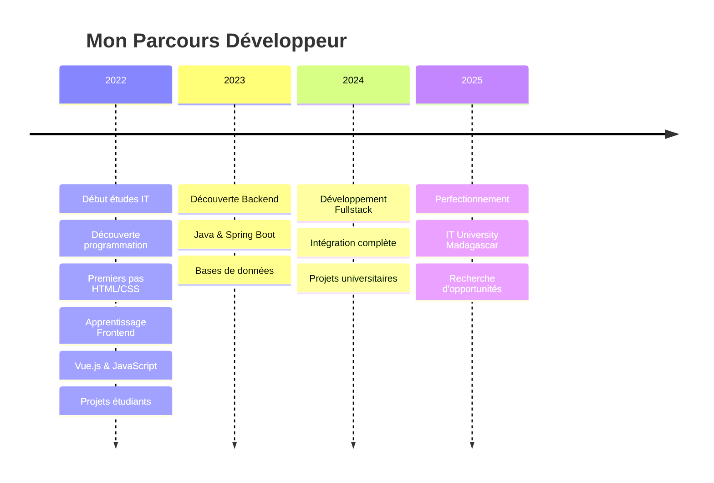

<!-- Header avec animation de vague -->
<div align="center">
  
</div>

<!-- Badges professionnels -->
<div align="center">
  
</div>

<br>

<div align="center">
  <a href="https://github.com/antsamadagascar">
    
  </a>
  
  
</div>

---

##  Qui suis-je ?

<table>
<tr>
<td>

**💫 Développeur Fullstack Junior passionné**

Étudiant en génie logiciel à IT University Madagascar, je découvre et apprends le monde fascinant du développement web. Passionné par la création d'applications modernes, je développe mes compétences techniques jour après jour.

**🎯 Mon objectif :** Maîtriser les technologies web modernes et contribuer à des projets innovants tout en continuant d'apprendre et de grandir professionnellement.

</td>
<td>

```json
{
  "nom": "Ny Antsa RATOVONANDRASANA",
  "âge": "En formation continue",
  "localisation": "Antananarivo, Madagascar",
  "rôle": "Développeur Fullstack Junior",
  "passion": "Apprentissage & Développement Web",
  "objectif": "Devenir un développeur accompli",
  "motto": "Apprendre, coder, grandir"
}
```

</td>
</tr>
</table>

---

## 🚀 Arsenal Technologique

<div align="center">

### Frontend Universe
<p>
  
  
  
  
  
</p>

### Backend Powerhouse
<p>
  
  
  
  
  
</p>

### Database & Storage
<p>
  
  
  
</p>

### Cloud & DevOps
<p>
  
  
  
</p>

</div>

---

## 📊 Performance GitHub

<div align="center">
  
  
</div>

<div align="center">
  
</div>

---

## 🎯 Domaines d'Apprentissage

<div align="center">

<table>
<tr>
<td align="center" width="25%">

**🎨 Frontend**
<br>
*Interfaces utilisateur*
<br>
Vue.js, React, JavaScript

</td>
<td align="center" width="25%">

**⚙️ Backend**
<br>
*Logique serveur*
<br>
Java, PHP, Spring Boot

</td>
<td align="center" width="25%">

**🗄️ Données**
<br>
*Bases de données*
<br>
MySQL, PostgreSQL

</td>
<td align="center" width="25%">

**🔧 Outils**
<br>
*Développement*
<br>
Git, Docker, VS Code

</td>
</tr>
</table>

</div>

---

## 📚 Projets d'Apprentissage

<div align="center">

| 📖 Projet | 🎯 Objectif | 📅 Période |
|-----------|-------------|------------|
| **🛒 Daily-Expenses** | Maîtriser LiveWire + Laravel | Projet Personnels |
| **📝 API de Gestion** | Apprendre Spring Boot | En cours |
| **🎨 Portfolio Personnel** | Pratiquer React | Récent |
| **📊 Dashboard Admin** | Intégrer frontend/backend | Planifié |

</div>

---

## 📈 Métriques de Contribution

<div align="center">
  
</div>

<div align="center">
  
</div>

---

## 💡 Philosophie de Développement

<div align="center">

> *"Le code propre n'est pas écrit en suivant un ensemble de règles. On reconnait le code propre en lisant quelqu'un qui s'en souciait."*
> 
> **— Robert C. Martin**

</div>

<table align="center">
<tr>
<td align="center" width="33%">

**🎯 Clean Code**
<br>
*Code lisible et maintenable*

</td>
<td align="center" width="33%">

**⚡ Performance**
<br>
*Optimisation constante*

</td>
<td align="center" width="33%">

**🔒 Sécurité**
<br>
*Sécurité by design*

</td>
</tr>
</table>

---

## 🎓 Parcours & Formation

<div align="center">



</div>

---

## 🌐 Connectons-nous !

<div align="center">

### 💬 Étudiant motivé, toujours prêt à apprendre et à contribuer !

<p>
  <a href="mailto:antsamadagascar@gmail.com">
    
  </a>
  <a href="https://www.linkedin.com/in/aina-ny-antsa-ratovonandrasana">
    
  </a>
  <a href="https://github.com/antsamadagascar">
    
  </a>
</p>

### 🤝 Ouvert aux opportunités :
- Stages de développement web
- Projets étudiants collaboratifs
- Mentorat et apprentissage
- Discussions techniques
- Premières expériences professionnelles

</div>

---

<!-- Footer avec animation -->
<div align="center">
  
</div>

<div align="center">
  <h3>✨ Merci de votre visite ! ✨</h3>
  <p><em>N'hésitez pas à explorer mes repositories d'apprentissage et à me contacter !</em></p>
</div>
