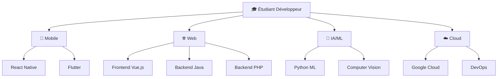

# <div align="center">🌌 Ny Antsa - Digital Alchemist & Code Virtuoso 🌌</div>

<div align="center">
  
  
  <picture>
    <source media="(prefers-color-scheme: dark)" srcset="https://readme-typing-svg.demolab.com?font=Fira+Code&weight=800&size=32&duration=2200&pause=700&color=00ff41&background=0D111700&center=true&vCenter=true&multiline=true&repeat=true&width=1100&height=240&lines=%F0%9F%8C%9F+class+CodeAlchemist+%7B;++%E2%9A%A1+transform(ideas)+%3D%3E+reality;++%F0%9F%9A%80+deploy(dreams)+%3D%3E+applications;++%F0%9F%A7%A0+solve(impossible)+%3D%3E+elegant_solutions;++%F0%9F%94%A5+status+%3D+%22Always+Innovating%22;++%F0%9F%8E%93+seeking+internship+%3D+true;%7D;%E2%9C%A8+new+CodeAlchemist(%22Ny+Antsa%22).create();">
    
  </picture>

  
  
  
</div>

---

## <div align="center">🎭 Who Am I? - Mon Univers Digital</div>

<div align="center">
  
</div>

<div align="center">
  
  

  

</div>
<div align="center">
  <table>
    <tr>
      <td align="center" width="50%">
        
        <h3>🚀 Qui suis-je ?</h3>
      </td>
      <td align="left" width="50%">
        <h4><strong>RATOVONANDRASANA Aina Ny Antsa</strong></h4>
        <p>🎓 <strong>Étudiant en 3ème année</strong> - Licence Développement à l'IT University Madagascar</p>
        <p>💼 <strong>Recherche activement un stage</strong> pour mettre en pratique mes compétences</p>
        <p>🔥 <strong>Passion</strong> : Transformer chaque contrainte technique en opportunité d'innovation</p>
        <p>⚡ <strong>Vision</strong> : Je ne me contente pas d'écrire du code, je sculpte des solutions</p>
      </td>
    </tr>
  </table>
</div>

### <div align="center">🎯 Ma Mission & Mes Objectifs</div>

<div align="center">
  
</div>

| 🎯 **Ma Mission** | 🔥 **Mon Secret** | ⚡ **Ma Force** | 🎓 **Mon Objectif** |
|:---:|:---:|:---:|:---:|
| Créer des expériences<br>digitales qui marquent<br>les esprits | Voir des solutions<br>là où d'autres voient<br>des obstacles | Transformer l'impossible<br>en évident | Décrocher un stage<br>enrichissant pour<br>ma 3ème année |

### <div align="center">🌟 Pourquoi Choisir de Collaborer avec Moi ?</div>

<div align="center">
  
</div>

```yaml
Profil_Etudiant:
  nom: "Ny Antsa RATOVONANDRASANA"
  niveau: "3ème année Licence Développement"
  université: "IT University Madagascar"
  
  Status_Actuel:
    📚 formation: "En cours - Développement Fullstack"
    🔍 recherche: "Stage pratique et formateur"
    ⏰ disponibilité: "Immédiate pour stage"
    💪 motivation: "100% déterminé à apprendre"
  
  Qualités_Uniques:
    🧠 mindset: "Pattern recognition + Problem solving"
    🚀 approche: "Apprendre vite, s'adapter rapidement"
    💡 créativité: "Solutions innovantes aux défis techniques"
    🤝 collaboration: "Esprit d'équipe et communication"
  
  Recherche_Stage:
    🎯 domaines: ["Développement Web", "Applications Mobile", "DevOps", "Cloud"]
    📅 durée: "3-6 mois"
    🌍 lieu: "Madagascar ou Remote"
    💼 type: "Stage conventionné université"
```

<div align="center">
  <a href="https://github.com/antsamadagascar">
    
  </a>
  <a href="mailto:nyantsa.ratovo@gmail.com">
    
  </a>
  <a href="https://github.com/antsamadagascar">
    
  </a>
  <a href="https://github.com/antsamadagascar">
    
  </a>
  
</div>

---

## <div align="center">⚡ Tech Arsenal & Superpowers</div>

<div align="center">
  
  
  
</div>

### 🎨 **Frontend Artistry - L'Art du Visuel**
<div align="center">
  
  <br><br>
  
  
  
  
  
  
</div>

### 🏗️ **Backend Mastery - La Puissance du Serveur**
<div align="center">
  
  <br><br>
  
  
  
  
</div>

### 🗄️ **Database Wizardry - Maître des Données**
<div align="center">
  
  
  <br><br>
  
  
  
  
</div>

### ☁️ **DevOps & Cloud Engineering - L'Architecte du Cloud**
<div align="center">
  
  <br><br>
  
  
  
  
  
</div>

---

## <div align="center">📊 Performance & Analytics - Mon Évolution Numérique</div>

<div align="center">
  
</div>

<div align="center">
  
  
</div>

<div align="center">
  
</div>

### <div align="center">🔥 Contribution Evolution - Mon Parcours de Code</div>
<div align="center">
  
</div>

---

## <div align="center">🏆 Hall of Digital Fame</div>

<div align="center">
  
</div>

<div align="center">
  
</div>

### <div align="center">🐍 Neural Network Visualization</div>
<div align="center">
  
</div>

---

## <div align="center">🎯 My Skills Configuration</div>

```javascript
const nyAntsa = {
    role: "Digital Architect & Solution Engineer",
    status: "3rd Year Student - Seeking Internship 🎓",
    university: "IT University Madagascar",
    
    expertise: {
        backend: ["Java", "Spring Boot", "PHP", "Laravel", "API Design"],
        frontend: ["Vue.js", "React", "Modern JavaScript", "Responsive Design"],
        database: ["MySQL", "PostgreSQL", "Oracle", "Data Architecture"],
        devops: ["Docker", "Cloud Deployment"],
        cloud: ["Google Cloud Platform", "Firebase", "Cloud Architecture"]
    },
    
    mindset: {
        philosophy: "Transform constraints into opportunities",
        approach: "Pattern recognition + Creative problem solving",
        focus: "Building impactful digital experiences"
    },
    
    internshipGoals: {
        seeking: "Practical experience in real-world projects",
        duration: "3-6 months",
        interests: ["Web Development", "Mobile Apps", "DevOps", "Cloud"],
        location: "Madagascar or Remote",
        availability: "Immediate"
    },
    
    currentlyMastering: ["Advanced K8s", "Cloud-Native Architecture", "Microservices"],
    funFact: "I debug with my morning coffee ☕ and deploy with evening tea 🍵",
    motto: "En apprentissage constant, prêt à relever de nouveaux défis !"
};

console.log("Ready to build something amazing together! 🚀");
console.log("Looking for internship opportunities! 💼");
```

---

## <div align="center">🎓 Mon Parcours Étudiant & Opportunités</div>

<div align="center">
  
</div>

### 📚 **Ma Situation Académique Actuelle**

<div align="center">

| 🎓 **Formation** | 📍 **Université** | 📅 **Niveau** | 🎯 **Spécialisation** |
|:---:|:---:|:---:|:---:|
| Licence Développement | IT University Madagascar | 3ème Année | Développement Fullstack |

</div>

### 🔍 **Recherche de Stage - Mes Aspirations**

<div align="center">
  <table>
    <tr>
      <td align="center" width="25%">
        
        <h4>💼 Type de Stage</h4>
        <p>Stage conventionné<br>Mission pratique<br>Équipe dynamique</p>
      </td>
      <td align="center" width="25%">
        
        <h4>⏰ Durée</h4>
        <p>3 à 6 mois<br>Flexible selon<br>les besoins</p>
      </td>
      <td align="center" width="25%">
        
        <h4>🌍 Localisation</h4>
        <p>Madagascar<br>Remote<br>Hybride</p>
      </td>
      <td align="center" width="25%">
        
        <h4>🚀 Domaines</h4>
        <p>Web/Mobile<br>DevOps/Cloud<br>Innovation Tech</p>
      </td>
    </tr>
  </table>
</div>

### 🌟 **Opportunités de Collaboration Étudiant**

<div align="center">

| 📚 **Apprentissage** | 🤝 **Collaboration** | 🚀 **Évolution** | 💡 **Innovation** |
|:---:|:---:|:---:|:---:|
| 📖 Projets Académiques | 👥 Équipes Étudiantes | 🌱 Développement Personnel | 🧪 Expérimentations |
| 💻 Coding Bootcamps | 🎯 Hackathons | 📈 Montée en Compétences | 🔬 Recherche |
| 🏆 Compétitions Tech | 🌐 Open Source | 🎪 Stages & Alternances | 💭 Idées Créatives |
| 🎨 Projets Créatifs | 🤖 Clubs Tech | 🎓 Mentoring | 🌟 Startup Étudiante |

</div>

---

## <div align="center">🌟 Mon Parcours d'Évolution</div>

<div align="center">
  
</div>

### 📚 **Phase Apprentissage** (Actuellement)
- 🏫 **Formation** - Licence Développement à l'IT University Madagascar
- 📖 **Cours en Ligne** - Autodidacte, StackOverflow, OpenClassrooms
- 💻 **Projets Personnels** - Applications web, scripts, automatisations
- 🎯 **Objectifs** - Maîtriser les fondamentaux et bonnes pratiques

### 🚀 **Phase Développement** (6-12 mois)
- 🔧 **Technologies Cibles** - React Native, Vue.js, PHP, Java, Cloud
- 🏢 **Stages** - Recherche d'opportunités en entreprise
- 🌐 **Réseau** - Participation à des meetups et conférences
- 📊 **Portfolio** - Création d'un portfolio professionnel

---

## <div align="center">🎓 Mes Domaines d'Intérêt</div>



---

## <div align="center">🤝 Connect with the Digital Alchemist</div>

<div align="center">
  
</div>

<div align="center">
  <a href="mailto:nyantsa.ratovo@gmail.com">
    
  </a>
  <a href="https://www.linkedin.com/in/aina-ny-antsa-ratovonandrasana">
    
  </a>
  <a href="tel:+261385497169">
    
  </a>
</div>

<div align="center">
  
  
  
</div>

---

<div align="center">
  
  
  

  <div>
    
    
    
    
  </div>

  ### 💫 "The future belongs to those who see possibilities in patterns"

  ⭐ **If you find my work inspiring, don't forget to star some repos!** ⭐

  💬 **"En apprentissage constant, prêt à relever de nouveaux défis !"**

  🎓 **Étudiant en 3ème année | Recherche stage enrichissant**

  ---

  **Made with ❤️ and lots of ☕ by Ny Antsa**  
  **Last updated: 2025 🚀**  
  **Status: Seeking Internship Opportunities 💼**

</div>
