# <div align="center">🌌 **Ny Antsa** - Digital Alchemist & Code Virtuoso 🌌</div>

<div align="center">
  
  
  
  <picture>
    <source media="(prefers-color-scheme: dark)" srcset="https://readme-typing-svg.demolab.com?font=JetBrains+Mono&weight=800&size=32&duration=2000&pause=500&color=00ff41&background=0D1117&center=true&vCenter=true&multiline=true&repeat=true&width=1200&height=250&lines=%F0%9F%8C%9F+class+CodeAlchemist+%7B;++%E2%9A%A1+transform(ideas)+%3D%3E+reality;++%F0%9F%9A%80+deploy(dreams)+%3D%3E+applications;++%F0%9F%A7%A0+solve(impossible)+%3D%3E+elegant_solutions;++%F0%9F%94%A5+status+%3D+%22Always+Innovating%22;%7D;%E2%9C%A8+new+CodeAlchemist(%22Ny+Antsa%22).create();">
    
  </picture>

  
  
  
  
  
  
  <div style="background: linear-gradient(45deg, #ff6b9d, #00d9ff, #00ff41); padding: 3px; border-radius: 20px; display: inline-block;">
    <div style="background: #0D1117; padding: 20px; border-radius: 17px;">
      
    </div>
  </div>

</div>

## <div align="center">🎭 **Who Am I?**</div>

<div align="center">
  
</div>

> ### 💡 *"I see patterns where others see walls 🧠 — there's always a way if you think differently."*

<div align="center">
  <table>
    <tr>
      <td align="center" width="50%">
        <h3>🚀 Ma Mission</h3>
        <p>Créer des expériences digitales qui marquent les esprits</p>
      </td>
      <td align="center" width="50%">
        <h3>🔥 Mon Secret</h3>
        <p>Voir des solutions là où d'autres voient des obstacles</p>
      </td>
    </tr>
    <tr>
      <td align="center" width="50%">
        <h3>⚡ Ma Force</h3>
        <p>Transformer l'impossible en évident</p>
      </td>
      <td align="center" width="50%">
        <h3>🎯 Mon Objectif</h3>
        <p>Sculpter des solutions qui changent la donne</p>
      </td>
    </tr>
  </table>
</div>

**RATOVONANDRASANA Aina Ny Antsa** - Je ne me contente pas d'écrire du code, je **sculpte des solutions**. Développeur fullstack passionné et architecte DevOps, je transforme chaque contrainte technique en opportunité d'innovation.

<div align="center">
  
  
  
  [](https://github.com/antsamadagascar)
  [](https://github.com/antsamadagascar)
  [](https://github.com/antsamadagascar)

</div>

---

## <div align="center">⚡ **Tech Arsenal & Superpowers**</div>

<div align="center">
  
  
  
  
  
</div>

<details open>
<summary><h3 align="center">🎨 <strong>Frontend Artistry</strong></h3></summary>

<div align="center">
  
  
  
  <table>
  <tr>
    <td align="center" width="20%" style="background: linear-gradient(45deg, #4FC08D, #35495E); border-radius: 15px; padding: 10px;">
      
      <br><strong>Vue.js</strong>
      <br><small>⭐⭐⭐⭐⭐</small>
    </td>
    <td align="center" width="20%" style="background: linear-gradient(45deg, #61DAFB, #20232A); border-radius: 15px; padding: 10px;">
      
      <br><strong>React</strong>
      <br><small>⭐⭐⭐⭐⭐</small>
    </td>
    <td align="center" width="20%" style="background: linear-gradient(45deg, #E34F26, #F16529); border-radius: 15px; padding: 10px;">
      
      <br><strong>HTML5</strong>
      <br><small>⭐⭐⭐⭐⭐</small>
    </td>
    <td align="center" width="20%" style="background: linear-gradient(45deg, #1572B6, #33A9DC); border-radius: 15px; padding: 10px;">
      
      <br><strong>CSS3</strong>
      <br><small>⭐⭐⭐⭐⭐</small>
    </td>
    <td align="center" width="20%" style="background: linear-gradient(45deg, #F7DF1E, #F0DB4F); border-radius: 15px; padding: 10px;">
      
      <br><strong>JavaScript</strong>
      <br><small>⭐⭐⭐⭐⭐</small>
    </td>
  </tr>
  </table>
  
  <div style="margin: 20px 0;">
    
    
    
    
    
    
  </div>

</div>
</details>

<details>
<summary><h3 align="center">🏗️ <strong>Backend Mastery</strong></h3></summary>

<div align="center">
  
  
  
  <table>
  <tr>
    <td align="center" width="25%" style="background: linear-gradient(45deg, #ED8B00, #F89820); border-radius: 15px; padding: 15px;">
      
      <br><strong>Java</strong>
      <br><small>⭐⭐⭐⭐⭐</small>
    </td>
    <td align="center" width="25%" style="background: linear-gradient(45deg, #6DB33F, #4CAF50); border-radius: 15px; padding: 15px;">
      
      <br><strong>Spring Boot</strong>
      <br><small>⭐⭐⭐⭐⭐</small>
    </td>
    <td align="center" width="25%" style="background: linear-gradient(45deg, #777BB4, #8892BF); border-radius: 15px; padding: 15px;">
      
      <br><strong>PHP</strong>
      <br><small>⭐⭐⭐⭐⭐</small>
    </td>
    <td align="center" width="25%" style="background: linear-gradient(45deg, #FF2D20, #FF5722); border-radius: 15px; padding: 15px;">
      
      <br><strong>Laravel</strong>
      <br><small>⭐⭐⭐⭐⭐</small>
    </td>
  </tr>
  </table>
  
  <div style="margin: 20px 0;">
    
    
    
    
  </div>

</div>
</details>

<details>
<summary><h3 align="center">🗄️ <strong>Database Wizardry</strong></h3></summary>

<div align="center">
  
  
  
  <table>
  <tr>
    <td align="center" width="25%" style="background: linear-gradient(45deg, #00618A, #4479A1); border-radius: 15px; padding: 15px;">
      
      <br><strong>MySQL</strong>
      <br><small>⭐⭐⭐⭐⭐</small>
    </td>
    <td align="center" width="25%" style="background: linear-gradient(45deg, #316192, #336791); border-radius: 15px; padding: 15px;">
      
      <br><strong>PostgreSQL</strong>
      <br><small>⭐⭐⭐⭐⭐</small>
    </td>
    <td align="center" width="25%" style="background: linear-gradient(45deg, #F80000, #FF4444); border-radius: 15px; padding: 15px;">
      
      <br><strong>Oracle</strong>
      <br><small>⭐⭐⭐⭐⭐</small>
    </td>
    <td align="center" width="25%" style="background: linear-gradient(45deg, #4EA94B, #47A248); border-radius: 15px; padding: 15px;">
      
      <br><strong>MongoDB</strong>
      <br><small>⭐⭐⭐⭐⭐</small>
    </td>
  </tr>
  </table>
  
  <div style="margin: 20px 0;">
    
    
    
    
  </div>

</div>
</details>

<details>
<summary><h3 align="center">☁️ <strong>DevOps & Cloud Engineering</strong></h3></summary>

<div align="center">
  
  
  
  <table>
  <tr>
    <td align="center" width="16.66%" style="background: linear-gradient(45deg, #2496ED, #0066CC); border-radius: 15px; padding: 12px;">
      
      <br><strong>Docker</strong>
      <br><small>⭐⭐⭐⭐⭐</small>
    </td>
    <td align="center" width="16.66%" style="background: linear-gradient(45deg, #4285F4, #34A853); border-radius: 15px; padding: 12px;">
      
      <br><strong>Google Cloud</strong>
      <br><small>⭐⭐⭐⭐⭐</small>
    </td>
    <td align="center" width="16.66%" style="background: linear-gradient(45deg, #039BE5, #FF8A00); border-radius: 15px; padding: 12px;">
      
      <br><strong>Firebase</strong>
      <br><small>⭐⭐⭐⭐⭐</small>
    </td>
    <td align="center" width="16.66%" style="background: linear-gradient(45deg, #FCC624, #E95420); border-radius: 15px; padding: 12px;">
      
      <br><strong>Linux</strong>
      <br><small>⭐⭐⭐⭐⭐</small>
    </td>
    <td align="center" width="16.66%" style="background: linear-gradient(45deg, #F05032, #FF6B6B); border-radius: 15px; padding: 12px;">
      
      <br><strong>Git</strong>
      <br><small>⭐⭐⭐⭐⭐</small>
    </td>
    <td align="center" width="16.66%" style="background: linear-gradient(45deg, #181717, #4078C0); border-radius: 15px; padding: 12px;">
      
      <br><strong>GitHub Actions</strong>
      <br><small>⭐⭐⭐⭐⭐</small>
    </td>
  </tr>
  </table>
  
  <div style="margin: 20px 0;">
    
    
    
    
    
  </div>

</div>
</details>

---

## <div align="center">📊 **Performance & Analytics**</div>

<div align="center">
  
  
  
  <div style="display: flex; justify-content: center; gap: 20px; flex-wrap: wrap;">
    
    
  </div>
  
  
  
  
  
  

</div>

### <div align="center">🔥 **Contribution Heatmap - Live Feed**</div>

<div align="center">
  
  
  
  [](https://github.com/ashutosh00710/github-readme-activity-graph)
  
</div>

---

## <div align="center">🏆 **Hall of Digital Fame**</div>

<div align="center">
  
  
  
  [](https://github.com/ryo-ma/github-profile-trophy)
  
</div>

---

### <div align="center">🐍 **Neural Network Visualization**</div>

<div align="center">
  
  
  
  
  
</div>

---

## <div align="center">🎯 **My Skill**</div>

<div align="center">
  
  

```javascript
const nyAntsa = {
    role: "Digital Architect & Solution Engineer",
    expertise: {
        backend: ["Java", "Spring Boot", "PHP", "Laravel", "API Design"],
        frontend: ["Vue.js", "React", "Modern JavaScript", "Responsive Design"],
        database: ["MySQL", "PostgreSQL", "Oracle", "Data Architecture"],
        devops: ["Docker", "Cloud Deployment"],
        cloud: ["Google Cloud Platform", "Firebase", "Cloud Architecture"]
    },
    mindset: {
        philosophy: "Transform constraints into opportunities",
        approach: "Pattern recognition + Creative problem solving",
        focus: "Building impactful digital experiences"
    },
    currentlyMastering: ["Advanced K8s", "Cloud-Native Architecture", "Microservices"],
    funFact: "I debug with my morning coffee ☕ and deploy with evening tea 🍵"
};
console.log("Ready to build something amazing together! 🚀");
```

</div>

## <div align="center">🤝 **Connect with the Digital Alchemist**</div>

# 🎓 **Opportunités de Collaboration Étudiant**

<div align="center">
  
  
  
  <table style="border-collapse: collapse; border: 3px solid #00ff41; border-radius: 15px;">
    <tr style="background: linear-gradient(45deg, #1a1a2e, #16213e);">
      <th align="center" style="padding: 15px; color: #00ff41;">📚 **Apprentissage**</th>
      <th align="center" style="padding: 15px; color: #00d9ff;">🤝 **Collaboration**</th>
      <th align="center" style="padding: 15px; color: #ff6b9d;">🚀 **Évolution**</th>
      <th align="center" style="padding: 15px; color: #ffa500;">💡 **Innovation**</th>
    </tr>
    <tr>
      <td align="center" style="padding: 12px;">📖 **Projets Académiques**</td>
      <td align="center" style="padding: 12px;">👥 **Équipes Étudiantes**</td>
      <td align="center" style="padding: 12px;">🌱 **Développement Personnel**</td>
      <td align="center" style="padding: 12px;">🧪 **Projets Expérimentaux**</td>
    </tr>
    <tr>
      <td align="center" style="padding: 12px;">💻 **Coding Bootcamps**</td>
      <td align="center" style="padding: 12px;">🎯 **Hackathons Étudiants**</td>
      <td align="center" style="padding: 12px;">📈 **Montée en Compétences**</td>
      <td align="center" style="padding: 12px;">🔬 **Recherche Appliquée**</td>
    </tr>
    <tr>
      <td align="center" style="padding: 12px;">🏆 **Compétitions Tech**</td>
      <td align="center" style="padding: 12px;">🌐 **Communautés Open Source**</td>
      <td align="center" style="padding: 12px;">🎪 **Stages & Alternances**</td>
      <td align="center" style="padding: 12px;">💭 **Idées Créatives**</td>
    </tr>
    <tr>
      <td align="center" style="padding: 12px;">🎨 **Projets Créatifs**</td>
      <td align="center" style="padding: 12px;">🤖 **Clubs Informatique**</td>
      <td align="center" style="padding: 12px;">🎓 **Mentoring**</td>
      <td align="center" style="padding: 12px;">🌟 **Startup Étudiante**</td>
    </tr>
  </table>

</div>

---

## 🌟 **Mon Parcours d'Évolution**

<div align="center">
  
</div>

### 📚 **Phase Apprentissage** (Actuellement)

<div align="center">
  <table style="border: 2px solid #00ff41; border-radius: 15px; background: linear-gradient(45deg, #0D1117, #1a1a2e);">
    <tr>
      <td align="center" width="25%" style="padding: 15px;">
        <br>
        <strong>🏫 Formation</strong><br>
        Études en cours Licence Développement a l'It University Madagascar
      </td>
      <td align="center" width="25%" style="padding: 15px;">
        <br>
        <strong>📖 Cours en Ligne</strong><br>
        Autodidacte, StackOverflow, OpenClassrooms
      </td>
      <td align="center" width="25%" style="padding: 15px;">
        <br>
        <strong>💻 Projets Personnels</strong><br>
        Applications web, scripts, automatisations
      </td>
      <td align="center" width="25%" style="padding: 15px;">
        <br>
        <strong>🎯 Objectifs</strong><br>
        Maîtriser les fondamentaux et bonnes pratiques
      </td>
    </tr>
  </table>
</div>

### 🚀 **Phase Développement** (6-12 mois)

<div align="center">
  <table style="border: 2px solid #00d9ff; border-radius: 15px; background: linear-gradient(45deg, #0D1117, #16213e);">
    <tr>
      <td align="center" width="25%" style="padding: 15px;">
        <br>
        <strong>🔧 Technologies Cibles</strong><br>
        React Native, Vue Js, PHP, JAVA, Cloud
      </td>
      <td align="center" width="25%" style="padding: 15px;">
        <br>
        <strong>🏢 Stages</strong><br>
        Recherche d'opportunités en entreprise
      </td>
      <td align="center" width="25%" style="padding: 15px;">
        <br>
        <strong>🌐 Réseau</strong><br>
        Participation à des meetups et conférences
      </td>
      <td align="center" width="25%" style="padding: 15px;">
        <br>
        <strong>📊 Portfolio</strong><br>
        Création d'un portfolio professionnel
      </td>
    </tr>
  </table>
</div>

### 🏢 **Opportunités Professionnelles**

<div align="center">
  <table style="border: 2px solid #ff6b9d; border-radius: 15px; background: linear-gradient(45deg, #0D1117, #0f3460);">
    <tr>
      <td align="center" width="25%" style="padding: 15px;">
        <br>
        <strong>🎪 Stages</strong><br>
        Développement web, Web Services, Architecture logicielles
      </td>
      <td align="center" width="25%" style="padding: 15px;">
        <br>
        <strong>💼 Alternance</strong><br>
        Recherche d'entreprises pour formation en alternance
      </td>
      <td align="center" width="25%" style="padding: 15px;">
        <br>
        <strong>🤝 Mentorat</strong><br>
        Besoin de mentors expérimentés dans le domaine
      </td>
      <td align="center" width="25%" style="padding: 15px;">
        <br>
        <strong>🌟 Freelance</strong><br>
        Petites missions pour acquérir de l'expérience
      </td>
    </tr>
  </table>
</div>

<div align="center">
  
  
  
</div>

---

## 🎓 **Mes Domaines d'Intérêt**

```mermaid
graph TB
    A[🎓 Étudiant Développeur] --> B[📱 Mobile]
    A --> C[🌐 Web]
    A --> D[🤖 IA/ML]
    A --> E[☁️ Cloud]
    
    B --> B1[React Native]
    B --> B2[Flutter]
    
    C --> C1[Frontend Vue Js]
    C --> C2[Backend Java]
    C --> C3[Backend PHP]
    
    D --> D1[Python ML]
    D --> D2[Computer Vision]
    
    E --> E1[Google Cloud]
    E --> E2[DevOps]
    
    style A fill:#00ff41,stroke:#000,stroke-width:3px,color:#000
    style B fill:#ff6b9d,stroke:#000,stroke-width:2px,color:#fff
    style C fill:#00d9ff,stroke:#000,stroke-width:2px,color:#000
    style D fill:#ffa500,stroke:#000,stroke-width:2px,color:#000
    style E fill:#9d4edd,stroke:#000,stroke-width:2px,color:#fff
```

<div align="center">
  
  
  


</div>

<div align="center">
  
  
  
  
  
  <div style="margin: 30px 0;">
    
    
    
    
  </div>
  
</div>

## <div align="center">🌐 **Digital Presence Network**</div>

<div align="center">
  
  
  
  <table style="border: none; background: transparent;">
    <tr>
      <td align="center" style="padding: 20px;">
        <div style="background: linear-gradient(45deg, #D14836, #EA4335); padding: 15px; border-radius: 25px; box-shadow: 0 8px 32px rgba(209, 72, 54, 0.3);">
          <a href="mailto:antsamadagascar@gmail.com">
            
          </a>
        </div>
      </td>
      <td align="center" style="padding: 20px;">
        <div style="background: linear-gradient(45deg, #0077B5, #00A0DC); padding: 15px; border-radius: 25px; box-shadow: 0 8px 32px rgba(0, 119, 181, 0.3);">
          <a href="https://www.linkedin.com/in/aina-ny-antsa-ratovonandrasana">
            
          </a>
        </div>
      </td>
      <td align="center" style="padding: 20px;">
        <div style="background: linear-gradient(45deg, #25D366, #128C7E); padding: 15px; border-radius: 25px; box-shadow: 0 8px 32px rgba(37, 211, 102, 0.3);">
          <a href="tel:+261385497169">
            
          </a>
        </div>
      </td>
    </tr>
  </table>
  
</div>

<div align="center">
  
  
  
  
  
  ### 💫 *"The future belongs to those who see possibilities in patterns"*
  
  <div style="background: linear-gradient(45deg, #ff6b9d, #00d9ff, #00ff41); padding: 3px; border-radius: 15px; display: inline-block; margin: 20px 0;">
    <div style="background: #0D1117; padding: 15px; border-radius: 12px;">
      <strong>⭐ If you find my work inspiring, don't forget to star some repos! ⭐</strong>
    </div>
  </div>
  
  
  
</div>

<div align="center">
  
  
  
  **Made with ❤️ and lots of ☕ by Ny Antsa**  
  *Last updated: 2025 🚀*
  
  
  
</div>
