```mermaid
graph TB
    A[🎓 Étudiant Développeur] --> B[📱 Mobile]
    A --> C[🌐 Web]
    A --> D[🤖 IA/ML]
    A --> E[☁️ Cloud]

    B --> B1[React Native]
    B --> B2[Flutter]

    C --> C1[Frontend Vue.js]
    C --> C2[Backend Java]
    C --> C3[Backend PHP]

    D --> D1[Python ML]
    D --> D2[Computer Vision]

    E --> E1[Google Cloud]
    E --> E2[DevOps]
```

# <div align="center">🌌 Ny Antsa - Digital Alchemist & Code Virtuoso 🌌</div>

<div align="center">
  
  
  <picture>
    <source media="(prefers-color-scheme: dark)" srcset="https://readme-typing-svg.demolab.com?font=Fira+Code&weight=800&size=30&duration=2500&pause=800&color=00ff41&background=0D111700&center=true&vCenter=true&multiline=true&repeat=true&width=1000&height=220&lines=%F0%9F%8C%9F+class+CodeAlchemist+%7B;++%E2%9A%A1+transform(ideas)+%3D%3E+reality;++%F0%9F%9A%80+deploy(dreams)+%3D%3E+applications;++%F0%9F%A7%A0+solve(impossible)+%3D%3E+elegant_solutions;++%F0%9F%94%A5+status+%3D+%22Always+Innovating%22;%7D;%E2%9C%A8+new+CodeAlchemist(%22Ny+Antsa%22).create();">
    
  </picture>

  
  
  
</div>

## <div align="center">🎭 Who Am I?</div>

<div align="center">
  
</div>

**RATOVONANDRASANA Aina Ny Antsa** - Je ne me contente pas d'écrire du code, je sculpte des solutions. Développeur fullstack passionné et architecte DevOps, je transforme chaque contrainte technique en opportunité d'innovation.

🎯 **Ma mission** : Créer des expériences digitales qui marquent les esprits  
🔥 **Mon secret** : Voir des solutions là où d'autres voient des obstacles  
⚡ **Ma force** : Transformer l'impossible en évident  

<div align="center">
  <a href="https://github.com/antsamadagascar">
    
  </a>
  <a href="https://github.com/antsamadagascar">
    
  </a>
  
</div>

---

## <div align="center">⚡ Tech Arsenal & Superpowers</div>

<div align="center">
  
</div>

### 🎨 **Frontend Artistry**
<div align="center">
  
  <br><br>
  
  
  
  
  
  
</div>

### 🏗️ **Backend Mastery**
<div align="center">
  
  <br><br>
  
  
  
  
</div>

### 🗄️ **Database Wizardry**
<div align="center">
  
  
  <br><br>
  
  
  
  
</div>

### ☁️ **DevOps & Cloud Engineering**
<div align="center">
  
  <br><br>
  
  
  
  
  
</div>

---

## <div align="center">📊 Performance & Analytics</div>

<div align="center">
  
  
</div>

<div align="center">
  
</div>

### <div align="center">🔥 Contribution Evolution</div>
<div align="center">
  
</div>

---

## <div align="center">🏆 Hall of Digital Fame</div>

<div align="center">
  
</div>

### <div align="center">🐍 Neural Network Visualization</div>
<div align="center">
  
</div>

---

## <div align="center">🎯 My Skills Configuration</div>

```javascript
const nyAntsa = {
    role: "Digital Architect & Solution Engineer",
    expertise: {
        backend: ["Java", "Spring Boot", "PHP", "Laravel", "API Design"],
        frontend: ["Vue.js", "React", "Modern JavaScript", "Responsive Design"],
        database: ["MySQL", "PostgreSQL", "Oracle", "Data Architecture"],
        devops: ["Docker", "Cloud Deployment"],
        cloud: ["Google Cloud Platform", "Firebase", "Cloud Architecture"]
    },
    mindset: {
        philosophy: "Transform constraints into opportunities",
        approach: "Pattern recognition + Creative problem solving",
        focus: "Building impactful digital experiences"
    },
    currentlyMastering: ["Advanced K8s", "Cloud-Native Architecture", "Microservices"],
    funFact: "I debug with my morning coffee ☕ and deploy with evening tea 🍵"
};

console.log("Ready to build something amazing together! 🚀");
```

---

## <div align="center">🎓 Opportunités de Collaboration Étudiant</div>

<div align="center">

| 📚 **Apprentissage** | 🤝 **Collaboration** | 🚀 **Évolution** | 💡 **Innovation** |
|:---:|:---:|:---:|:---:|
| 📖 Projets Académiques | 👥 Équipes Étudiantes | 🌱 Développement Personnel | 🧪 Expérimentations |
| 💻 Coding Bootcamps | 🎯 Hackathons | 📈 Montée en Compétences | 🔬 Recherche |
| 🏆 Compétitions Tech | 🌐 Open Source | 🎪 Stages & Alternances | 💭 Idées Créatives |
| 🎨 Projets Créatifs | 🤖 Clubs Tech | 🎓 Mentoring | 🌟 Startup Étudiante |

</div>

---

## <div align="center">🌟 Mon Parcours d'Évolution</div>

### 📚 **Phase Apprentissage** (Actuellement)
- 🏫 **Formation** - Licence Développement à l'IT University Madagascar
- 📖 **Cours en Ligne** - Autodidacte, StackOverflow, OpenClassrooms
- 💻 **Projets Personnels** - Applications web, scripts, automatisations
- 🎯 **Objectifs** - Maîtriser les fondamentaux et bonnes pratiques

### 🚀 **Phase Développement** (6-12 mois)
- 🔧 **Technologies Cibles** - React Native, Vue.js, PHP, Java, Cloud
- 🏢 **Stages** - Recherche d'opportunités en entreprise
- 🌐 **Réseau** - Participation à des meetups et conférences
- 📊 **Portfolio** - Création d'un portfolio professionnel

---

## <div align="center">🎓 Mes Domaines d'Intérêt</div>



---

## <div align="center">🤝 Connect with the Digital Alchemist</div>

<div align="center">
  <a href="mailto:antsamadagascar@gmail.com">
    
  </a>
  <a href="https://www.linkedin.com/in/aina-ny-antsa-ratovonandrasana">
    
  </a>
  <a href="tel:+261385497169">
    
  </a>
</div>

---

<div align="center">
  
  
  

  <div>
    
    
    
  </div>

  ### 💫 "The future belongs to those who see possibilities in patterns"

  ⭐ **If you find my work inspiring, don't forget to star some repos!** ⭐

  💬 **"En apprentissage constant, prêt à relever de nouveaux défis !"**

  ---

  **Made with ❤️ and lots of ☕ by Ny Antsa**  
  **Last updated: 2025 🚀**

</div>
